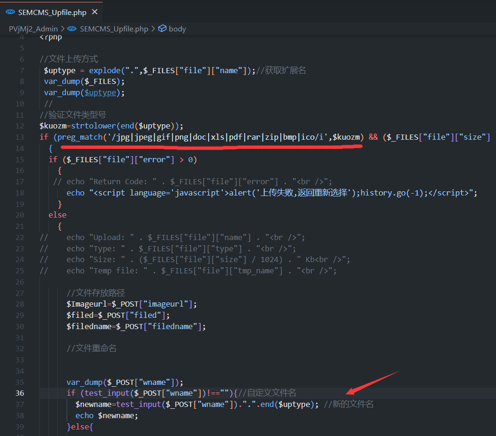
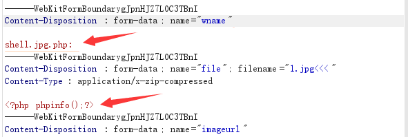
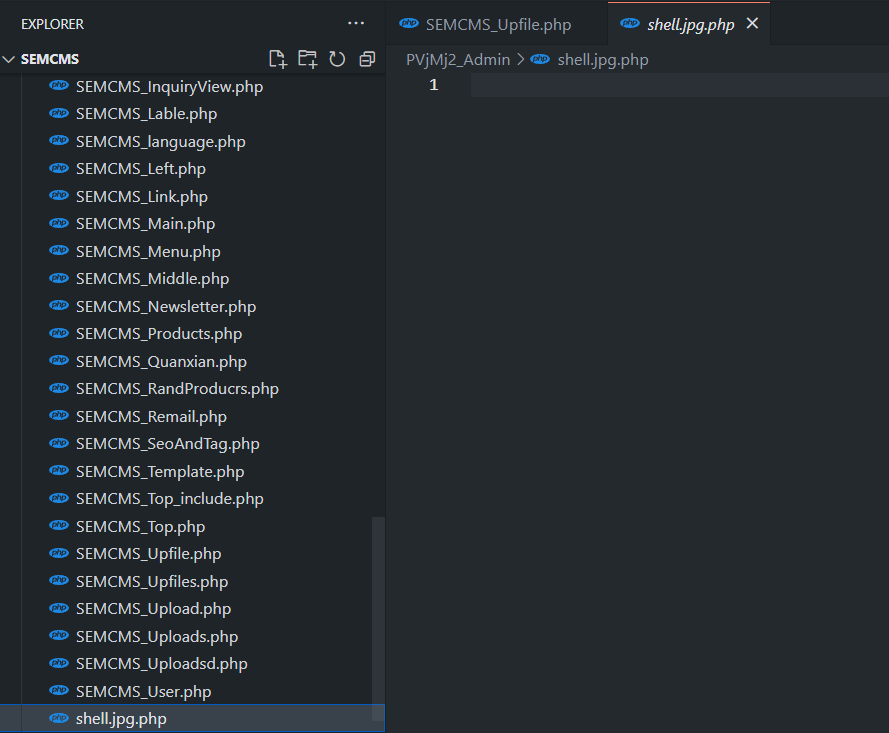
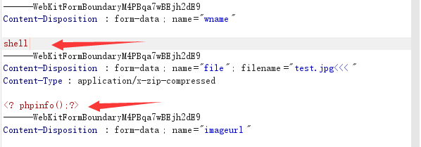
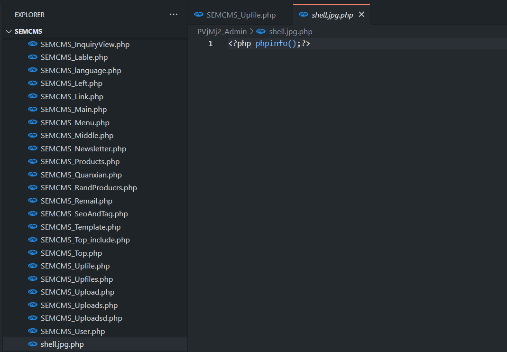

## Semcms Shop V4.2 后台文件上传getshell

On **SEMCMS_Upfile.php**

Regular matching for white lists can be passed as long as the **file suffix has the white list**

It is possible to **control the file name**, and the suffix is spliced from the previously obtained file suffix

**第一次上传**

`wname=shell.jpg.php: filename=test.jpg` 

At this point, after splicing, `$newname=shell.jpg.php:.jpg` is displayed. On Windows platforms, the following `:` file name will change to `shell.jpg.php` due to non-compliance with the rules, but the php point to `shell.jpg.php:.jpg`, so the file content cannot be transferred in. At this point, an empty php file has been constructed

**第二次上传**

`wname=shell filename=test.jpg<<<`

After splicing, `$newname=shell.jpg<<<`, while `<` in Windows is equivalent to a wildcard character, which will match `shell.jpg.php`

To transfer the file content to ` shell.jpg.php`

After uploading any php file, you can try getshell